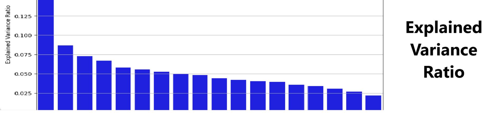
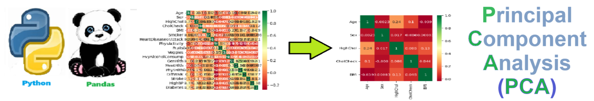

# Principal Component Analysis - Solution for Principal Component Analysis
Solution for Principal Component Analysis


## Overview of Principal Component Analysis (PCA)
Principal Component Analysis (PCA) is a dimensionality reduction technique commonly used in data science to simplify large datasets while preserving as much variance as possible. The main purpose of PCA is to transform data into a new coordinate system where the greatest variances (or principal components) are aligned with the axes. This helps reduce the complexity of data, allowing for more efficient analysis and visualization, especially when working with datasets that have a large number of variables or features.

Key benefits of PCA include:

Reducing dimensionality: It helps in reducing the number of features while keeping the most important information.
Improving interpretability: It makes it easier to visualize data in 2D or 3D while maintaining key patterns.
Enhancing computational efficiency: It speeds up the analysis by reducing the feature space, making algorithms more efficient.
PCA is widely used in areas like image processing, exploratory data analysis, and pre-processing for machine learning algorithms.

Here’s a sample **README.md** file for a **Principal Component Analysis (PCA) solution** using **Scikit-learn's PCA** library:

---

# Principal Component Analysis (PCA) with Scikit-Learn

This project demonstrates how to implement **Principal Component Analysis (PCA)** using Python’s **Scikit-Learn (sklearn)** library. PCA is a technique for reducing the dimensionality of datasets, increasing interpretability while minimizing information loss.

## Table of Contents
1. [Introduction](#introduction)
2. [Installation](#installation)
3. [Usage](#usage)
4. [Dataset](#dataset)
5. [PCA Workflow](#pca-workflow)
6. [Results](#results)
7. [Contributing](#contributing)
8. [License](#license)

## Introduction

**Principal Component Analysis (PCA)** is a statistical method used to reduce the number of features (dimensionality) of a dataset by transforming it into a new set of variables, the *principal components*, which capture the most significant variance in the data. This project aims to showcase how to apply PCA using **Scikit-Learn** to simplify datasets for more efficient machine learning and visualization.

## Installation

To run this project, you'll need to install the required dependencies. Ensure you have Python installed and run:

```bash
pip install -r requirements.txt
```

### Dependencies

- **numpy**: For numerical operations.
- **pandas**: For data manipulation.
- **scikit-learn**: For implementing PCA.
- **matplotlib**: For visualizations.

```bash
pip install numpy pandas scikit-learn matplotlib
```

## Usage

To use the PCA solution:

1. Clone this repository:
   ```bash
   git clone https://github.com/yourusername/pca-solution.git
   cd pca-solution
   ```

2. Prepare your dataset or use the provided example data.
3. Run the Python script to perform PCA:
   ```bash
   python pca_solution.py
   ```

### Example Usage
Here's how you can apply PCA to a dataset:

```python
import numpy as np
import pandas as pd
from sklearn.decomposition import PCA
from sklearn.preprocessing import StandardScaler

# Load dataset
data = pd.read_csv("your_data.csv")

# Standardize the data
scaler = StandardScaler()
data_scaled = scaler.fit_transform(data)

# Apply PCA
pca = PCA(n_components=2)  # Reduce to 2 principal components
principal_components = pca.fit_transform(data_scaled)

# Visualize the result
plt.scatter(principal_components[:, 0], principal_components[:, 1])
plt.title('PCA Result')
plt.show()
```

## Dataset

The dataset should be a **CSV file** with numerical values. Each row represents an observation, and each column represents a feature. Ensure that your dataset does not contain categorical data, or encode them numerically before applying PCA.

## PCA Workflow

1. **Data Preprocessing**: Standardize the dataset to have a mean of 0 and a standard deviation of 1. This step is crucial to ensure that all features contribute equally to the PCA results.
2. **Fit PCA Model**: Use Scikit-Learn’s `PCA` class to fit the model to the dataset and determine the principal components.
3. **Transform Data**: Reduce the dataset dimensions by projecting the original data onto the principal components.
4. **Visualize Components**: Optionally, you can visualize the data in the space of the principal components.

## Results

The result of PCA will be a transformed dataset with fewer dimensions. You can also visualize the explained variance for each principal component to understand how much information each component retains.

Example of explained variance:
```python
print(pca.explained_variance_ratio_)
```

## Contributing

Contributions are welcome! If you'd like to contribute, feel free to fork the repository and make a pull request.

## License

This project is licensed under the **MIT License**.

---

### Optional: Requirements File (requirements.txt)
```txt
numpy
pandas
scikit-learn
matplotlib
```

This **README.md** provides a structured and clear overview of a PCA implementation using **Scikit-Learn**, making it easy for users to understand how to use the solution and apply it to their own data.




## Getting Started
To get started with the **Principal Component Analysis** solution repository, follow these steps:
1. Clone the repository to your local machine.
2. Install the required dependencies listed at the top of the notebook.
3. Explore the example code provided in the repository and experiment.
4. Run the notebook and make it your own - **EASY !**
    
## Solution Features
- Easy to understand and use  
- Easily Configurable 
- Quickly start your project with pre-built templates
- Its Fast and Automated

## Notebook Features
- **Self Documenting** - Automatically identifes major steps in notebook 
- **Self Testing** - Unit Testing for each function
- **Easily Configurable** - Easily modify with **config.INI** - keyname value pairs
- **Includes Talking Code** - The code explains itself 
- **Self Logging** - Enhanced python standard logging   
- **Self Debugging** - Enhanced python standard debugging
- **Low Code** - or - No Code  - Most solutions are under 50 lines of code
- **Educational** - Includes educational dialogue and background material
    
## Deliverables or Figures
   <br>
    

## Github    
## https://github.com/JoeEberle/ 

## Email 
## josepheberle@outlook.com 

    


    